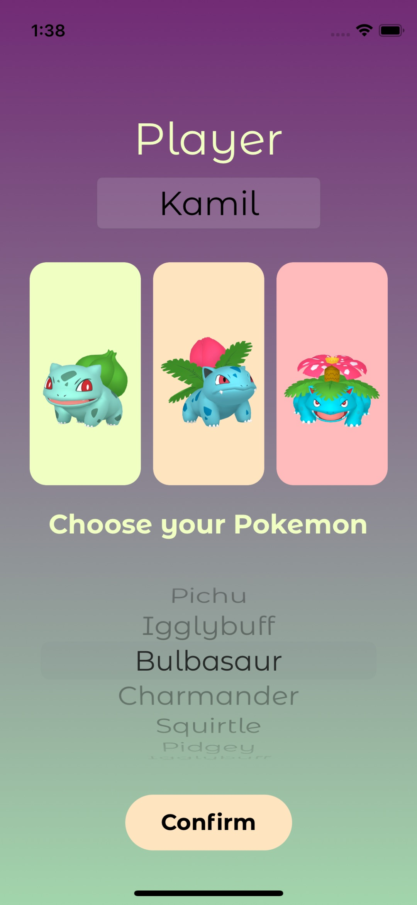
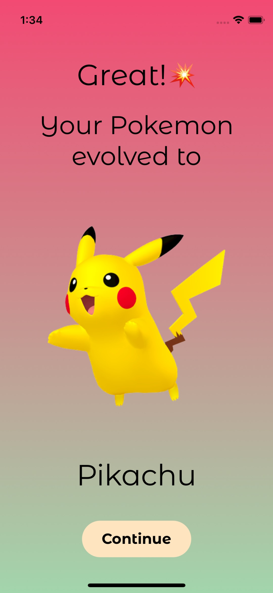
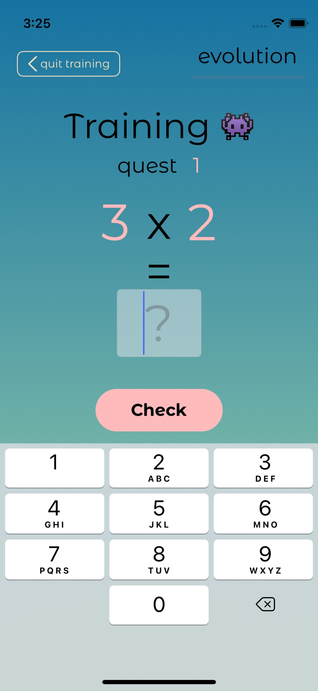
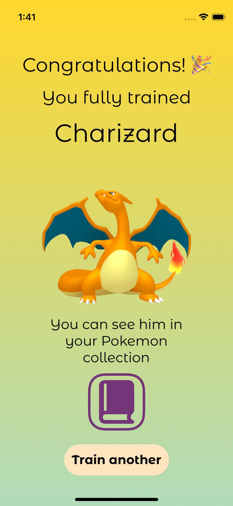
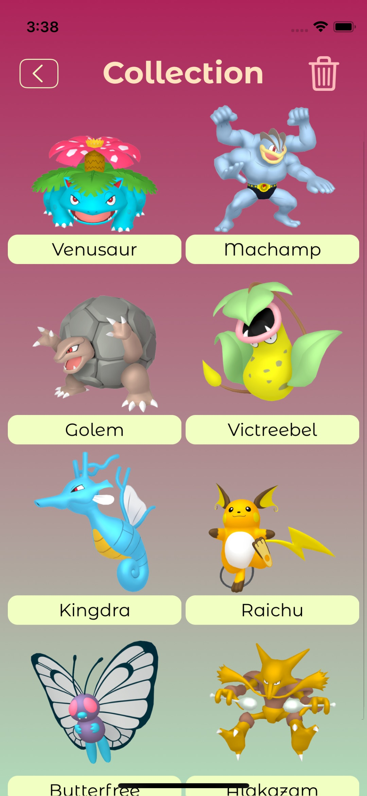

# MultiPokeation

Multiply, train and collect your Pokemons.

I created this app on end Kilo Loco iOS bootcamp to check my skills and learn new features in iOS programing.

Additionally, I wanted to teach my nephew the multiplication tables in an interesting way.
He became the first manual tester and was delighted to learn multiply this way.

Below few screenshots of the app.
I used PokeAPI in this project.

